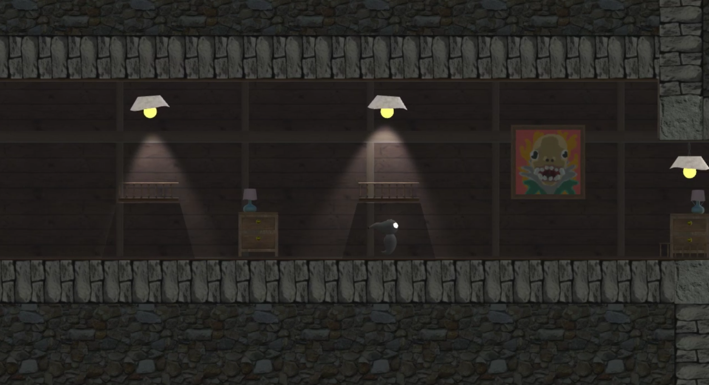
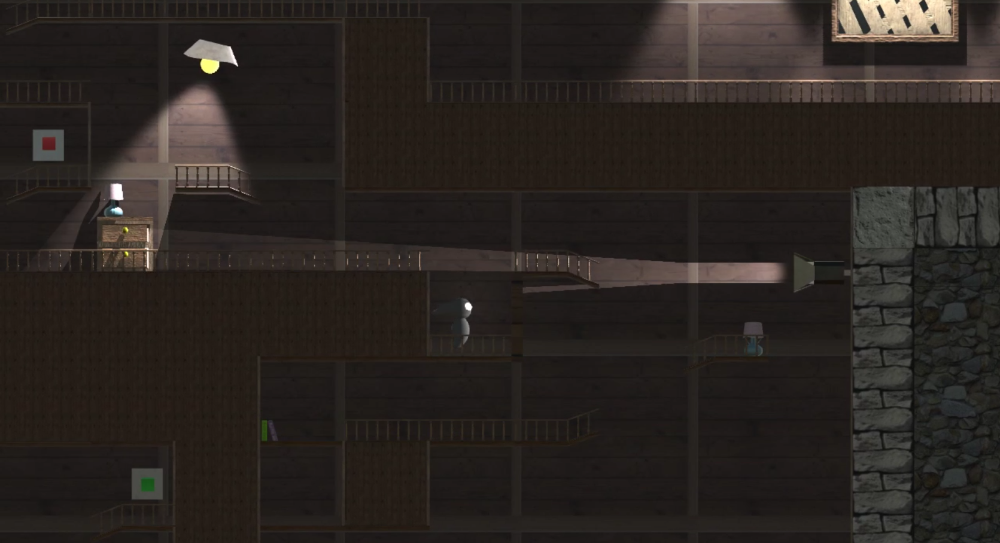

# Lost Soul (Game Jam) (September 2019)
Lost Soul is a Game Jam game created by myself and other AIE students.

The Game Jam was held at AIE Campus Canberra on September 2019. The theme of the jam was **Restoring Harmony**. 
Our group consisted of five members: two artists, two designers and myself as the programmer. We were given one weekend to create a game that somewhat related to the theme.

We created a 2D platformer in **C# Unity** that involves guiding a lost soul through a level to reach its body. The soul must stay in darkness and avoid the light. This is the fundamental mechanic for the game - the player must avoid swinging ceiling lights, flickering lights and moving beam lights. The game consists of two relatively short levels that explore the basic mechanics of the game.

It was a fun challenge for me to work with lights in 2D. We ran into many hurdles due to mixing 2D sprites with 3D models. However, in the end the game was completed successfully. We are all very proud of it.

**Lost Soul Gameplay Video - [LINK](https://youtu.be/aNcu5BkrzKw)** 
 
**Screenshots** 

 

## Credits & Acknowledgements
### Design
- Matthew Eccles
- Rowan Brown
### Art
- Sebastian Tuckwell
- Samuel Donaldson
### Programming
- David Flintoft

    
 
Academy of Interactive Entertainment Canberra 
